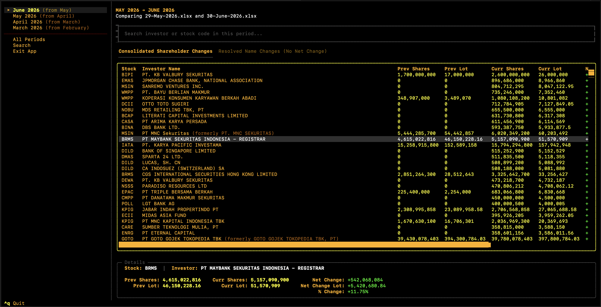

# Project Description

A command-line tool designed to parse and compare consecutive Indonesian Stock Exchange (IDX) shareholder report files. It scans chronological reports to track shareholder movements, share increases/decreases, exits, entries, transfers, and stock modifications over time, rendering a detailed summary in the terminal.

